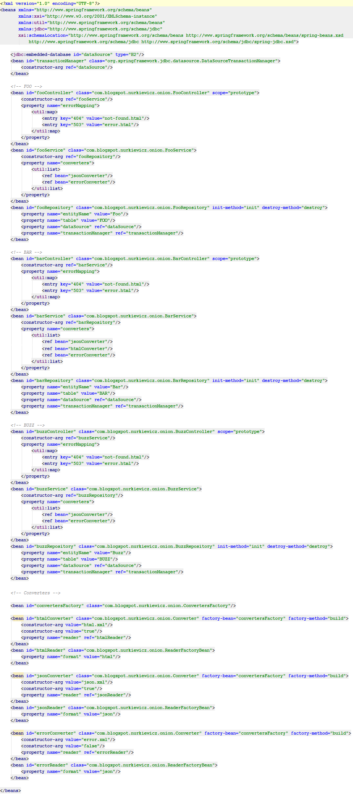

# Custom Spring namespaces made easier with JAXB

First of all, let me tell this out loud: **Spring is no longer XML-heavy**. As a matter of fact you can write Spring applications these days with minimal or no XML at all, using plenty of annotations, [Java configuration](http://docs.spring.io/spring/docs/current/spring-framework-reference/html/beans.html#beans-java) and [Spring Boot](https://github.com/spring-projects/spring-boot). Seriously stop ranting about Spring and XML, it's the thing the of the past.

That being said you might still be using XML for couple of reasons: you are stuck with legacy code base, you chose XML for other reasons or you use Spring as a foundation for some framework/platform. The last case is actually quite common, for example [Mule ESB](http://www.mulesoft.org/documentation/display/current/About+the+XML+Configuration+File) and [ActiveMQ](http://activemq.apache.org/xml-configuration.html) use Spring underneath to wire up their dependencies. Moreover Spring XML is their way to configure the framework. However configuring message broker or enterprise service bus using plain Spring `<bean/>`s would be cumbersome and verbose. Luckily Spring supports [writing custom namespaces](http://docs.spring.io/spring/docs/current/spring-framework-reference/html/extensible-xml.html) that can be embedded within standard Spring configuration files. These custom snippets of XML are preprocessed at runtime and can register many bean definitions at once in a concise and pleasantly looking (as far as XML allows) format. In a way custom namespaces are like macros that expand at runtime into multiple bean definitions. 

To give you a feeling of what are we aiming at, imagine a standard "enterprise" application that has several business entities. For each entity we define three, almost identical, beans: repository, service and controller. They are always wired in a similar way and only differ in small details. To begin with, our Spring XML looks like this (I am pasting screenshot with thumbnail to spare your eyes, it's huge and bloated):

This is a "layered" architecture, thus we will call our custom namespace called `onion` - because [onions have layers](http://www.imdb.com/title/tt0126029/quotes?item=qt0398107) - and also because systems designed this way make me cry. By the end of this article you will learn how to collapse this pile of XML into: 

	<?xml version="1.0" encoding="UTF-8"?>
	<b:beans xmlns:b="http://www.springframework.org/schema/beans"
	       xmlns="http://nurkiewicz.blogspot.com/spring/onion/spring-onion.xsd"
	       xmlns:xsi="http://www.w3.org/2001/XMLSchema-instance"
	       xsi:schemaLocation="http://www.springframework.org/schema/beans http://www.springframework.org/schema/beans/spring-beans.xsd
		       http://nurkiewicz.blogspot.com/spring/onion/spring-onion.xsd http://nurkiewicz.blogspot.com/spring/onion/spring-onion.xsd">
	
		<b:bean id="convertersFactory" class="com.blogspot.nurkiewicz.onion.ConvertersFactory"/>
	
		<converter format="html"/>
		<converter format="json"/>
		<converter format="error" lenient="false"/>
	
		<entity class="Foo" converters="json, error">
			<page response="404" dest="not-found"/>
			<page response="503" dest="error"/>
		</entity>
	
		<entity class="Bar" converters="json, html, error">
			<page response="400" dest="bad-request"/>
			<page response="500" dest="internal"/>
		</entity>
	
		<entity class="Buzz" converters="json, html">
			<page response="502" dest="bad-gateway"/>
		</entity>
	
	</b:beans>

Look closely, it's still Spring XML file that is perfectly understandable by this framework - and you will learn how to achieve this. You can run arbitrary code for each top-level custom XML tag, e.g. single occurrence of `<entity/>` registers repository, service and controller bean definitions all at once. The first thing to implement is writing a custom XML schema for our namespace. This is not that hard and will allow IntelliJ IDEA to show code completion in XML:
	
	<?xml version="1.0" encoding="UTF-8"?>
	<schema
			xmlns:tns="http://nurkiewicz.blogspot.com/spring/onion/spring-onion.xsd"
			xmlns="http://www.w3.org/2001/XMLSchema"
			targetNamespace="http://nurkiewicz.blogspot.com/spring/onion/spring-onion.xsd"
			elementFormDefault="qualified"
			attributeFormDefault="unqualified">
	
		<element name="entity">
			<complexType>
				<sequence>
					<element name="page" type="tns:Page" minOccurs="0" maxOccurs="unbounded"/>
				</sequence>
				<attribute name="class" type="string" use="required"/>
				<attribute name="converters" type="string"/>
			</complexType>
		</element>
		
		<complexType name="Page">
			<attribute name="response" type="int" use="required"/>
			<attribute name="dest" type="string" use="required"/>
		</complexType>
	
		<element name="converter">
			<complexType>
				<attribute name="format" type="string" use="required"/>
				<attribute name="lenient" type="boolean" default="true"/>
			</complexType>
		</element>
		
	</schema>

Once the schema is completed we must register it in Spring using two files:

`/META-INF/spring.schemas`:

	http\://nurkiewicz.blogspot.com/spring/onion/spring-onion.xsd=/com/blogspot/nurkiewicz/onion/ns/spring-onion.xsd

`/META-INF/spring.handlers`:

	http\://nurkiewicz.blogspot.com/spring/onion/spring-onion.xsd=com.blogspot.nurkiewicz.onion.ns.OnionNamespaceHandler

One maps schema URL into schema location locally, another points to so-called namespace handler. This class is fairly straightforward - it tells what to do with every top-level custom XML tag coming from this namespace encountered in Spring configuration file:

	import org.springframework.beans.factory.xml.NamespaceHandlerSupport;
	
	public class OnionNamespaceHandler extends NamespaceHandlerSupport {
		public void init() {
			registerBeanDefinitionParser("entity", new EntityBeanDefinitionParser());
			registerBeanDefinitionParser("converter", new ConverterBeanDefinitionParser());
		}
	}

So, when `<converter format="html"/>` piece of XML is found by Spring, it knows that our `ConverterBeanDefinitionParser` needs to be used. Remember that if our custom tag has children (like in the case of `<entity/>`), bean definition parser is called only for top-level tag. It is up to us how we parse and handle children. OK, so single `<converter/>` tag is suppose to create the following two beans:

	<bean id="htmlConverter" class="com.blogspot.nurkiewicz.onion.Converter" factory-bean="convertersFactory" factory-method="build">
		<constructor-arg value="html.xml"/>
		<constructor-arg value="true"/>
		<property name="reader" ref="htmlReader"/>
	</bean>
	<bean id="htmlReader" class="com.blogspot.nurkiewicz.onion.ReaderFactoryBean">
		<property name="format" value="html"/>
	</bean>

The responsibility of bean definition parser is to programmatically register bean definitions otherwise defined in XML. I won't go into details of the API, but compare it with the XML snippet above, they match closely to each other:

	import org.w3c.dom.Element;
	
	public class ConverterBeanDefinitionParser extends AbstractBeanDefinitionParser {
	
		@Override
		protected AbstractBeanDefinition parseInternal(Element converterElement, ParserContext parserContext) {
			final String format = converterElement.getAttribute("format");
			final String lenientStr = converterElement.getAttribute("lenient");
			final boolean lenient = lenientStr != null? Boolean.valueOf(lenientStr) : true;
			final BeanDefinitionRegistry registry = parserContext.getRegistry();
	
			final AbstractBeanDefinition converterBeanDef = converterBeanDef(format, lenient);
			registry.registerBeanDefinition(format + "Converter", converterBeanDef);
	
			final AbstractBeanDefinition readerBeanDef = readerBeanDef(format);
			registry.registerBeanDefinition(format + "Reader", readerBeanDef);
	
			return null;
		}
	
		private AbstractBeanDefinition readerBeanDef(String format) {
			return BeanDefinitionBuilder.
						rootBeanDefinition(ReaderFactoryBean.class).
						addPropertyValue("format", format).
						getBeanDefinition();
		}
	
		private AbstractBeanDefinition converterBeanDef(String format, boolean lenient) {
			AbstractBeanDefinition converterBeanDef = BeanDefinitionBuilder.
					rootBeanDefinition(Converter.class.getName()).
					addConstructorArgValue(format + ".xml").
					addConstructorArgValue(lenient).
					addPropertyReference("reader", format + "Reader").
					getBeanDefinition();
			converterBeanDef.setFactoryBeanName("convertersFactory");
			converterBeanDef.setFactoryMethodName("build");
			return converterBeanDef;
		}
	}

Do you see how `parseInternal()` receives XML `Element` representing `<converter/>` tag, extracts attributes and registers bean definitions? It's up to you how many beans you define in `AbstractBeanDefinitionParser` implementation. Just remember that we are barely constructing the configuration here, no instantiation took place yet. Once the XML file is fully parsed and all bean definition parsers triggered, Spring will start bootstrapping our application. One thing to keep in mind is returning `null` in the end. The API sort of expects you to return single bean definition. However no need to restrict ourselves, `null` is fine.

The second custom tag that we support is `<entity/>` that registers three beans at once. It's similar and thus not that interesting, see [full source of `EntityBeanDefinitionParser`](https://github.com/nurkiewicz/spring-ns/blob/master/src/main/java/com/blogspot/nurkiewicz/onion/ns/EntityBeanDefinitionParser.java). One important implementation detail that can be found there is the usage of [`ManagedList`](http://docs.spring.io/spring/docs/4.0.x/javadoc-api/org/springframework/beans/factory/support/ManagedList.html). Documentation vaguely mentions it but it's quite valuable. If you want to define a list of beans to be injected knowing their IDs, a simple `List<String>` is not sufficient, you must explicitly tell Spring you mean a list of bean references:

	List<BeanMetadataElement> converterRefs = new ManagedList<>();
	for (String converterName : converters) {
		converterRefs.add(new RuntimeBeanReference(converterName));
	}
	return BeanDefinitionBuilder.
			rootBeanDefinition("com.blogspot.nurkiewicz.FooService").
			addPropertyValue("converters", converterRefs).
			getBeanDefinition();
 
---

## Using JAXB to simplify bean definition parsers

OK, so by now you should be familiar with custom Spring namespaces and how they can help you. However they are quite low level by requiring you to parse custom tags using raw XML DOM API. However my team mate discovered that since we already have XSD schema file, why not use JAXB to handle XML parsing? First we ask maven to generate Java beans representing XML types and elements during build:

	<build>
		<plugins>
			<plugin>
				<groupId>org.jvnet.jaxb2.maven2</groupId>
				<artifactId>maven-jaxb22-plugin</artifactId>
				<version>0.8.3</version>
				<executions>
					<execution>
						<id>xjc</id>
						<goals>
							<goal>generate</goal>
						</goals>
					</execution>
				</executions>
				<configuration>
					<schemaDirectory>src/main/resources/com/blogspot/nurkiewicz/onion/ns</schemaDirectory>
					<generatePackage>com.blogspot.nurkiewicz.onion.ns.xml</generatePackage>
				</configuration>
			</plugin>
		</plugins>
	</build>

Under `/target/generated-sources/xjc` you will discover couple of Java files. I like generated JAXB models to have some commons prefix like `Xml`, which can be easily achieved with custom `bindings.xjb` file placed next to `spring-onion.xsd`:

	<bindings version="1.0"
	              xmlns="http://java.sun.com/xml/ns/jaxb"
	              xmlns:xs="http://www.w3.org/2001/XMLSchema"
	              extensionBindingPrefixes="xjc">
	
		<bindings schemaLocation="spring-onion.xsd" node="/xs:schema">
			<schemaBindings>
				<nameXmlTransform>
					<typeName prefix="Xml"/>
					<anonymousTypeName prefix="Xml"/>
					<elementName prefix="Xml"/>
				</nameXmlTransform>
			</schemaBindings>
		</bindings>
	
	</bindings>

How does it change our custom bean definition parser? Previously we had this:

	final String clazz = entityElement.getAttribute("class");
	//...
	final NodeList pageNodes = entityElement.getElementsByTagNameNS(NS, "page");
	for (int i = 0; i < pageNodes.getLength(); ++i) {  //...

Now we simply traverse Java beans:

	final XmlEntity entity = JaxbHelper.unmarshal(entityElement);
	final String clazz = entity.getClazz();
	//...
	for (XmlPage page : entity.getPage()) {  //...

`JaxbHelper` is just a simple tool that hides checked exceptions and JAXB mechanics from outside:

	public class JaxbHelper {
	
		private static final Unmarshaller unmarshaller = create();
	
		private static Unmarshaller create() {
			try {
				return JAXBContext.newInstance("com.blogspot.nurkiewicz.onion.ns.xml").createUnmarshaller();
			} catch (JAXBException e) {
				throw Throwables.propagate(e);
			}
		}
	
		public static <T> T unmarshal(Element elem) {
			try {
				return (T) unmarshaller.unmarshal(elem);
			} catch (JAXBException e) {
				throw Throwables.propagate(e);
			}
	
		}
	
	}

Couple of words as a summary. First of all I don't encourage you to auto-generate repository/service/controller bean definitions for every entity. Actually it's a poor practice but the domain is familiar to all of us so I thought it will be a good example. Secondly, more important, custom XML namespaces are a powerful tool that should be used as a last resort when everything else fails, namely [abstract beans](http://stackoverflow.com/questions/9397532), [factory beans](http://docs.spring.io/spring/docs/current/spring-framework-reference/html/beans.html#beans-factory-extension-factorybean) and Java configuration. Typically you'll want this kind of feature in frameworks or tools built in top of Spring. In that case check out [full source code on GitHub](https://github.com/nurkiewicz/spring-ns).